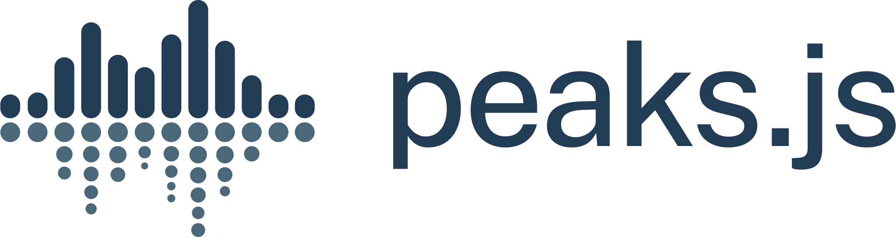

[](https://github.com/bbc/peaks.js/actions)

<p align="center">
  <a href="https://github.com/bbc/peaks.js"></a>
</p>

#

<p align="center">
  <strong>A client-side JavaScript component to display and interact with audio waveforms in the browser</strong>
</p>


Peaks.js was developed by [BBC R&D](https://www.bbc.co.uk/rd) to allow users to make accurate clippings of audio content in the browser, using a backend API that serves the waveform data.

Peaks.js uses the HTML canvas element to display the waveform at different zoom levels, and has configuration options to allow you to customize the waveform views. Peaks.js allows users to interact with the waveform views, including zooming and scrolling, and creating point or segment markers that denote content to be clipped or for reference, e.g., distinguishing music from speech or identifying different music tracks.

### Features

* Zoomable and scrollable waveform view
* Fixed width waveform view
* Mouse, touch, scroll wheel, and keyboard interaction
* Client-side waveform computation, using the Web Audio API, for convenience
* Server-side waveform computation, for efficiency
* Mono, stereo, or multi-channel waveform views
* Create point or segment marker annotations
* Customizable waveform views

You can read more about the project and see a demo [here](https://waveform.prototyping.bbc.co.uk/).

# Contents

- [Getting started](#getting-started)
  - [Installing Peaks.js](#installing-peaksjs)
    - [Add a <script> tag](#add-a-script-tag)
    - [Install with npm](#install-with-npm)
  - [Add Peaks.js to your web page](#add-peaksjs-to-your-web-page)
  - [Initialize Peaks.js](#initialize-peaksjs)
    - [Using a <script> tag](#using-a-script-tag)
    - [Using an ES2015 module import](#using-an-es2015-module-import)
  - [Next steps](#next-steps)
- [Demos](#demos)
- [Generating waveform data](#generating-waveform-data)
  - [Pre-computed waveform data](#pre-computed-waveform-data)
  - [Web Audio based waveform data](#web-audio-based-waveform-data)
- [Configuration](#configuration)
  - [Marker customization](#marker-customization)
  - [Player customization](#player-customization)
  - [Time label customization](#time-label-customization)
- [API](#api)
  - [Initialization](#initialization)
    - [Peaks.init()](#peaksinitoptions-callback)
    - [instance.setSource()](#instancesetsourceoptions-callback)
  - [Player API](#player-api)
    - [instance.player.play()](#instanceplayerplay)
    - [instance.player.pause()](#instanceplayerpause)
    - [instance.player.getCurrentTime()](#instanceplayergetcurrenttime)
    - [instance.player.getDuration()](#instanceplayergetduration)
    - [instance.player.seek()](#instanceplayerseektime)
    - [instance.player.playSegment()](#instanceplayerplaysegmentsegment-loop)
  - [Views API](#views-api)
    - [instance.views.getView()](#instanceviewsgetviewname)
    - [instance.views.createZoomview()](#instanceviewscreatezoomviewcontainer)
    - [instance.views.createOverview()](#instanceviewscreateoverviewcontainer)
    - [instance.views.destroyZoomview()](#instanceviewsdestroyzoomview)
    - [instance.views.destroyOverview()](#instanceviewsdestroyoverview)
  - [View API](#view-api)
    - [view.setAmplitudeScale()](#viewsetamplitudescalescale)
    - [view.setWaveformColor()](#viewsetwaveformcolorcolor)
    - [view.setPlayedWaveformColor()](#viewsetplayedwaveformcolorcolor)
    - [view.showPlayheadTime()](#viewshowplayheadtimeshow)
    - [view.setTimeLabelPrecision()](#viewsettimeLabelPrecisionprecision)
    - [view.enableAutoScroll()](#viewenableautoscrollenable)
    - [view.enableMarkerEditing()](#viewenablemarkereditingenable)
    - [view.fitToContainer()](#viewfittocontainer)
    - [view.setZoom()](#viewsetzoomoptions)
    - [view.setStartTime()](#viewsetstarttimetime)
    - [view.setWheelMode()](#viewsetwheelmodemode-options)
    - [view.enableSeek()](#viewenableseekenable)
  - [Zoom API](#zoom-api)
    - [instance.zoom.zoomIn()](#instancezoomzoomin)
    - [instance.zoom.zoomOut()](#instancezoomzoomout)
    - [instance.zoom.setZoom()](#instancezoomsetzoomindex)
    - [instance.zoom.getZoom()](#instancezoomgetzoom)
  - [Segments API](#segments-api)
    - [instance.segments.add()](#instancesegmentsaddsegment)
    - [instance.segments.getSegments()](#instancesegmentsgetsegments)
    - [instance.segments.getSegment()](#instancesegmentsgetsegmentid)
    - [instance.segments.removeByTime()](#instancesegmentsremovebytimestarttime-endtime)
    - [instance.segments.removeById()](#instancesegmentsremovebyidsegmentid)
    - [instance.segments.removeAll()](#instancesegmentsremoveall)
  - [Segment API](#segment-api)
    - [segment.update()](#segmentupdate-starttime-endtime-labeltext-color-editable--)
  - [Points API](#points-api)
    - [instance.points.add()](#instancepointsaddpoint)
    - [instance.points.getPoints()](#instancepointsgetpoints)
    - [instance.points.getPoint()](#instancepointsgetpointid)
    - [instance.points.removeByTime()](#instancepointsremovebytimetime)
    - [instance.points.removeById()](#instancepointsremovebyidpointid)
    - [instance.points.removeAll()](#instancepointsremoveall)
  - [Point API](#point-api)
    - [point.update()](#pointupdate-time-labeltext-color-editable--)
  - [Events](#events)
    - [instance.on()](#instanceonevent-callback)
    - [instance.once()](#instanceonceevent-callback)
    - [instance.off()](#instanceoffevent-callback)
  - [Destruction](#destruction)
    - [instance.destroy()](#instancedestroy)
- [Building Peaks.js](#building-peaksjs)
  - [Prerequisites](#prerequisites)
  - [Building](#building)
  - [Testing](#testing)
- [Contributing](#contributing)
- [License](#license)
- [Credits](#credits)

# Getting started

## Installing Peaks.js

You can start using Peaks.js by either including the UMD bundle in a `<script>` tag in your web page, or by installing it using `npm` or `yarn` and including it in your module bundle with [Webpack](https://webpack.js.org/), [Rollup](https://rollupjs.org/), [Parcel](https://parceljs.org/), etc.

### Add a <script> tag

To add the Peaks.js UMD bundle to your web page, add a `<script>` tag:

```html
<script src="https://unpkg.com/peaks.js/dist/peaks.js"></script>
```

The UMD bundle is available at [unpkg](https://unpkg.com/peaks.js) and [cdnjs](https://cdnjs.com/libraries/peaks.js).

### Install with npm

We recommend that you use an ES module bundler.

Run the following commands to include Peaks.js in your module bundle:

```bash
npm install --save peaks.js
npm install --save konva
npm install --save waveform-data
```

Note that Peaks.js uses [Konva](https://konvajs.org/) and [waveform-data](https://github.com/bbc/waveform-data.js) as peer dependencies, so you must also install those modules.

## Add Peaks.js to your web page

To include Peaks.js in your web page, you need to add container `<div>` elements that Peaks.js will use to render the waveform views, and a [media element](https://developer.mozilla.org/en-US/docs/Web/API/HTMLMediaElement) for your audio or video content. Here is an example HTML fragment:

```html
<div id="zoomview-container"></div>
<div id="overview-container"></div>
<audio>
  <source src="sample.mp3" type="audio/mpeg">
  <source src="sample.ogg" type='audio/ogg codecs="vorbis"'>
</audio>
```

The container `div`s should be left empty, as shown above, as their content will be replaced by the waveform view `canvas` elements. They should also be styled to have the desired width and height:

```css
#zoomview-container, #overview-container {
  width: 1000px;
  height: 100px;
}
```

## Initialize Peaks.js

The next step is to initialize a `Peaks` instance with [`Peaks.init()`](#initialization) and your own options.

Refer to the [Configuration](#configuration) section for details of the available options.

### Using a <script> tag

```html
<script src="https://unpkg.com/peaks.js/dist/peaks.js"></script>
<script>
(function(Peaks) {
  const options = {
    zoomview: {
      container: document.getElementById('zoomview-container')
    },
    overview: {
      container: document.getElementById('overview-container')
    },
    mediaElement: document.querySelector('audio'),
    webAudio: {
      audioContext: new AudioContext()
    }
  };

  Peaks.init(options, function(err, peaks) {
    if (err) {
      console.error('Failed to initialize Peaks instance: ' + err.message);
      return;
    }

    // Do something when the waveform is displayed and ready
  });
})(peaks);
</script>
```

### Using an ES2015 module import

```javascript
import Peaks from 'peaks.js';

const options = {
  zoomview: {
    container: document.getElementById('zoomview-container')
  },
  overview: {
    container: document.getElementById('overview-container')
  },
  mediaElement: document.querySelector('audio'),
  webAudio: {
    audioContext: new AudioContext()
  }
};

Peaks.init(options, function(err, peaks) {
  if (err) {
    console.error('Failed to initialize Peaks instance: ' + err.message);
    return;
  }

  // Do something when the waveform is displayed and ready
});
```

# Next steps

We recommend that you take a look at the [demos](#demos), which show how to use the various options and APIs that Peaks.js provides.

Read the [Generating waveform data](#generating-waveform-data) section to learn about how use either pre-computed or Web Audio generated waveform data.

Also refer to the [Configuration](#configuration) section for details of all the `Peaks.init()` options, and more advanced customization options, and the [API](#api) section to learn about the available API methods.

# Demos

The [demo](demo) folder contains some working examples of Peaks.js in use. To view these, enter the following commands:

```bash
git clone git@github.com:bbc/peaks.js.git
cd peaks.js
npm install
npm start
```

and then open your browser at http://localhost:8080.

There are also some example projects that show how to use Peaks.js with popular JavaScript frameworks:

* [React](https://github.com/chrisn/peaksjs-react-example)
* [Angular](https://github.com/chrisn/peaksjs-angular-example)

# Generating waveform data

Peaks.js creates its audio waveform visualization by processing the audio to produce waveform data. There are two ways that you can do this:

* Pre-compute the waveform data from the audio, using [audiowaveform](https://github.com/bbc/audiowaveform), and provide the data to Peaks.js from your web server
* Compute the waveform data in the browser using the Web Audio API

Using the Web Audio API can work well for short audio files, but involves downloading the entire audio file to the browser and is CPU intensive. Pre-computing the waveform data is preferable for longer audio files, because it saves your users' bandwidth and allows the waveform to be rendered faster.

## Pre-computed waveform data

Peaks.js uses waveform data files produced by [audiowaveform](https://github.com/bbc/audiowaveform). These can be generated in either binary (.dat) or JSON format. Binary format is preferred because of the smaller file size.

You should also use the `-b 8` option when generating waveform data files, as Peaks.js does not currently support 16-bit waveform data files, and also to minimise file size.

To generate a binary waveform data file:

```
audiowaveform -i sample.mp3 -o sample.dat -b 8
```

To generate a JSON format waveform data file:

```
audiowaveform -i sample.mp3 -o sample.json -b 8
```

Refer to the audiowaveform [documentation](https://github.com/bbc/audiowaveform) for full details of the available command line options, or use the manual page:

```bash
man audiowaveform
```

Once you have created a waveform data file, you can use this from Peaks.js by passing a `dataUri` option to `Peaks.init()`:

```javascript
import Peaks from 'peaks.js';

const options = {
  zoomview: {
    container: document.getElementById('zoomview-container')
  },
  overview: {
    container: document.getElementById('overview-container')
  },
  mediaElement: document.querySelector('audio'),
  dataUri: {
    arraybuffer: 'sample.dat' // or json: 'sample.json'
  }
};

Peaks.init(options, function(err, peaks) {
  // Do something when the waveform is displayed and ready, or handle errors
});
```

## Web Audio based waveform data

Peaks.js can use the [Web Audio API](https://www.w3.org/TR/webaudio/) to generate waveforms, which means you do not have to pre-compute a waveform data file beforehand.

To use Web Audio, omit the `dataUri` option and instead pass a `webAudio` object that contains an `AudioContext` instance. Your browser must [support](https://caniuse.com/#feat=audio-api) the Web Audio API.

```js
import Peaks from 'peaks.js';

const audioContext = new AudioContext();

const options = {
  zoomview: {
    container: document.getElementById('zoomview-container')
  },
  overview: {
    container: document.getElementById('overview-container')
  },
  mediaElement: document.querySelector('audio'),
  webAudio: {
    audioContext: audioContext,
    scale: 128,
    multiChannel: false
  }
};

Peaks.init(options, function(err, peaks) {
  // Do something when the waveform is displayed and ready, or handle errors
});
```

Alternatively, if you have an `AudioBuffer` containing decoded audio samples, e.g., from
[AudioContext.decodeAudioData](https://developer.mozilla.org/en-US/docs/Web/API/BaseAudioContext/decodeAudioData)
then an `AudioContext` is not needed:

```js
import Peaks from 'peaks.js';

const audioContext = new AudioContext();

// arrayBuffer contains the encoded audio (e.g., MP3 format)
audioContext.decodeAudioData(arrayBuffer)
  .then(function(audioBuffer) {
    const options = {
      zoomview: {
        container: document.getElementById('zoomview-container')
      },
      overview: {
        container: document.getElementById('overview-container')
      },
      mediaElement: document.querySelector('audio'),
      webAudio: {
        audioBuffer: audioBuffer
      }
    };

    Peaks.init(options, function(err, peaks) {
      // Do something when the waveform is displayed and ready, or handle errors
    });
  });
```

# Configuration

Peaks.js provides a number of configuration options, as follows:

```javascript
var options = {

  //
  // Zoomable waveform view options
  //

  zoomview: {
    // Container <div> element for the zoomable waveform view
    container: document.getElementById('zoomview-container'),

    // Color for the zoomable waveform
    // You can also use a 2 stop gradient here. See setWaveformColor()
    waveformColor: 'rgba(0, 225, 128, 1)',

    // Color for the played region of the zoomable waveform
    // You can also use a 2 stop gradient here. See setWaveformColor()
    playedWaveformColor: 'rgba(0, 225, 128, 1)',

    // Color of the playhead
    playheadColor: 'rgba(0, 0, 0, 1)',

    // Color of the playhead text
    playheadTextColor: '#aaa',

    // Tolerance for clicks in the zoomview to be interpreted as
    // dragging the playhead (pixels)
    playheadClickTolerance: 3,

    // Returns a string for the playhead timestamp label
    formatPlayheadTime: function,

    // Show current time next to the playhead
    showPlayheadTime: false,

    // Precision of time label of playhead and point/segment markers
    timeLabelPrecision: 2,

    // Color of the axis gridlines
    axisGridlineColor: '#ccc',

    // Color of the axis labels
    axisLabelColor: '#aaa',

    // Returns a string for the axis label timestamps
    formatAxisTime: function,

    // Show or hide the axis label timestamps
    showAxisLabels: true,

    // Font family for axis labels, playhead, and point and segment markers
    fontFamily: 'sans-serif',

    // Font size for axis labels, playhead, and point and segment markers
    fontSize: 11,

    // Font style for axis labels, playhead, and point and segment markers
    // (either 'normal', 'bold', or 'italic')
    fontStyle: 'normal',

    // Mouse-wheel mode: either 'none' or 'scroll'
    wheelMode: 'none'
  },

  //
  // Overview waveform options
  //

  overview: {
    // Container <div> element for the non-zoomable "overview" waveform
    overview: document.getElementById('overview-container')

    // Color for the overview waveform
    // You can also use a 2 stop gradient here. See setWaveformColor()
    waveformColor: 'rgba(0,0,0,0.2)',

    // Color for the played region of the overview waveform
    // You can also use a 2 stop gradient here. See setWaveformColor()
    playedWaveformColor: 'rgba(0, 225, 128, 1)',

    // Color for the overview waveform rectangle
    // that shows what the zoomable view shows
    highlightColor: 'grey',


    // Stroke color for the zoomed region
    highlightStrokeColor:   'transparent',

    // Opacity for the zoomed region
    highlightOpacity:       0.3,

    // Corner Radius for the zoomed region
    highlightCornerRadius:  2,

    // The default number of pixels from the top and bottom of the canvas
    // that the overviewHighlight takes up
    highlightOffset: 11,

    // Color of the playhead
    playheadColor: 'rgba(0, 0, 0, 1)',

    // Color of the playhead text
    playheadTextColor: '#aaa',

    // Returns a string for the playhead timestamp label
    formatPlayheadTime: function,

    // Show current time next to the play head
    showPlayheadTime: false,

    // Precision of time label of play head and point/segment markers
    timeLabelPrecision: 2,

    // Color of the axis gridlines
    axisGridlineColor: '#ccc',

    // Color of the axis labels
    axisLabelColor: '#aaa',

    // Returns a string for the axis label timestamps
    formatAxisTime: function,

    // Show or hide the axis label timestamps
    showAxisLabels: true,

    // Font family for axis labels, playhead, and point and segment markers
    fontFamily: 'sans-serif',

    // Font size for axis labels, playhead, and point and segment markers
    fontSize: 11,

    // Font style for axis labels, playhead, and point and segment markers
    // (either 'normal', 'bold', or 'italic')
    fontStyle: 'normal',
  },

  // HTML media element containing an audio track
  mediaElement: document.querySelector('audio'),

  //
  // Pre-computed waveform data options
  //

  dataUri: {
    // Binary format waveform data URL
    arraybuffer: '/data/sample.dat',

    // JSON format waveform data URL
    json: '/data/sample.json',
  },

  waveformData: {
    // ArrayBuffer containing binary format waveform data
    arraybuffer: null,

    // Object containing JSON format waveform data
    json: null
  },

  // If true, Peaks.js will send credentials with all network requests,
  // i.e., when fetching waveform data
  withCredentials: false,

  //
  // Web Audio generated waveform data options
  //

  webAudio: {
    // A Web Audio AudioContext instance which can be used
    // to render the waveform if dataUri is not provided
    audioContext: new AudioContext(),

    // Alternatively, provide an AudioBuffer containing the decoded audio
    // samples. In this case, an AudioContext is not needed
    audioBuffer: null,

    // If true, the waveform will show all available channels
    // If false, the audio is shown as a single channel waveform
    multiChannel: false
  },

  // Array of zoom levels in samples per pixel. Smaller numbers represent
  // being more "zoomed in".
  zoomLevels: [512, 1024, 2048, 4096],

  // To avoid computation when changing zoom level, Peaks.js maintains a cache
  // of waveforms at different zoom levels. This is enabled by default, but
  // can be disabled by setting waveformCache to false
  waveformCache: true

  //
  // Keyboard input options
  //

  // Bind keyboard controls
  keyboard: false,

  // Keyboard nudge increment in seconds (left arrow/right arrow)
  nudgeIncrement: 0.01,

  //
  // Default view options. Each of these can be set independently for each
  // waveform view, under the 'zoomview' and 'overview' options
  // (described above).
  //

  // Waveform color
  // You can also use a 2 stop gradient here. See setWaveformColor()
  waveformColor: 'rgba(0, 225, 128, 1)',

  // Color for the played waveform region
  // You can also use a 2 stop gradient here. See setWaveformColor()
  playedWaveformColor: 'rgba(0, 225, 128, 1)',

  // Color of the play head
  playheadColor: 'rgba(0, 0, 0, 1)',

  // Color of the play head text
  playheadTextColor: '#aaa',

  // Color of the axis gridlines
  axisGridlineColor: '#ccc',

  // Color of the axis labels
  axisLabelColor: '#aaa',

  // Font family for axis labels, playhead, and point and segment markers
  fontFamily: 'sans-serif',

  // Font size for axis labels, playhead, and point and segment markers
  fontSize: 11,

  // Font style for axis labels, playhead, and point and segment markers
  // (either 'normal', 'bold', or 'italic')
  fontStyle: 'normal',

  // Precision of time label of play head and point/segment markers
  timeLabelPrecision: 2,

  // Show current time next to the play head (zoomview only)
  showPlayheadTime: false,

  //
  // Point and segment options
  //

  // the color of a point marker
  pointMarkerColor: '#FF0000',

  // Color for segment start marker handles
  segmentStartMarkerColor: '#a0a0a0',

  // Color for segment end marker handles
  segmentEndMarkerColor: '#a0a0a0',

  // Color for segments on the waveform
  segmentColor: 'rgba(255, 161, 39, 1)',

  // Random color per segment (overrides segmentColor)
  randomizeSegmentColor: true,

  // if true, emit cue events on the Peaks instance (see Cue Events)
  emitCueEvents: false,

  //
  // Customization options (see customizing.md)
  //

  createSegmentMarker: null,
  createSegmentLabel: null,
  createPointMarker: null,
  player: null,

  //
  // Point and segment initialization
  //

  segments: [
    {
      startTime: 120,
      endTime: 140,
      editable: true,
      color: "#ff0000",
      labelText: "My label"
    },
    {
      startTime: 220,
      endTime: 240,
      editable: false,
      color: "#00ff00",
      labelText: "My Second label"
    }
  ],

  points: [
    {
      time: 150,
      editable: true,
      color: "#00ff00",
      labelText: "A point"
    },
    {
      time: 160,
      editable: true,
      color: "#00ff00",
      labelText: "Another point"
    }
  ],

  //
  // Debugging options
  //

  // Diagnostic or error information is written to this function.
  // The default is console.error
  logger: console.error.bind(console)
};
```

## Marker customization

Peaks.js allows you to customize the appearance of the point and segment
markers, by specifying the following configuration options: `createPointMarker`,
`createSegmentMarker`, and `createSegmentLabel`. Please read
[Customizing Peaks.js](customizing.md) for more details.

## Player customization

By default, Peaks.js supports audio playback using the HTML `<audio>` or
`<video>` element using the `mediaElement` configuration option. Peaks.js also
allows you to use your own custom media player library, using the `player`
option. Please read [Customizing Peaks.js](customizing.md#media-playback) for more details.

## Time label customization

Peaks.js allows you to customize the appearance of the time labels in the
time axis and next to the playhead, using the `formatPlayheadTime` and
`formatAxisTime` options. Please read
[Customizing Peaks.js](customizing.md#time-labels) for more details.

# API

## Initialization

The top level `Peaks` object exposes a factory function to create new `Peaks` instances.

### `Peaks.init(options, callback)`

Creates a new `Peaks` instance with the [assigned options](#Configuration).
The callback is invoked after the instance has been created and initialized, or if any errors occur during initialization.
You can create and manage several `Peaks` instances within a single page with one or several configurations.

```js
const options = { ... };

Peaks.init(options, function(err, peaks) {
  if (err) {
    console.error('Failed to initialize Peaks instance: ' + err.message);
    return;
  }

  console.log(peaks.player.getCurrentTime());
});
```

### `instance.setSource(options, callback)`

Changes the audio or video media source associated with the `Peaks` instance.

You should call this method when you want to change the audio or video media URL instead of directly setting the media element's `src` attribute, so that the `Peaks` instance can update the waveform views.

If you are using a [custom player object](customizing.md#media-playback) it's your responsibility to change the audio or video content in the player, but you should also call this method to update the waveform views.

Depending on the `options` specified, the waveform is either requested from a server or is generated by the browser using the Web Audio API.

The `options` parameter is an object with the following keys. Only one of `dataUri`, `waveformData`, or `webAudio` must be specified.

* `mediaUrl`: Audio or video media URL. This is required if you are using an `<audio>` or `<video>` element, and should be omitted if you are using a [custom player object](customizing.md#media-playback)
* `dataUri`: (optional) If requesting waveform data from a server, this should be an object containing `arraybuffer` and/or `json` values
  * `arraybuffer`: (optional) URL of the binary format waveform data (.dat) to request
  * `json`: (optional) URL of the JSON format waveform data to request
* `waveformData`: (optional) If using local or previously requested waveform data, this should be an object containing `arraybuffer` and/or `json` values
  * `arraybuffer`: (optional) the binary format waveform data (.dat)
  * `json`: (optional) the JSON format waveform data
* `webAudio`: (optional) If using the Web Audio API to generate the waveform, this should be an object containing the following values:
  * `audioContext`: (optional) A Web Audio `AudioContext` instance, used to compute the waveform data from the media
  * `audioBuffer`: (optional) A Web Audio `AudioBuffer` instance, containing the decoded audio samples. If present, this audio data is used and the `mediaUrl` is not fetched.
  * `multiChannel`: (optional) If `true`, the waveform will show all available channels. If `false` (the default), the audio is shown as a single channel waveform.
* `withCredentials`: (optional) If `true`, Peaks.js will send credentials when requesting the waveform data from a server
* `zoomLevels`: (optional) Array of zoom levels in samples per pixel. If not present, the values passed to [Peaks.init()](#peaksinitoptions-callback) will be used

For example, to change the media URL and request pre-computed waveform data from the server:

```js
const options = {
  mediaUrl: '/sample.mp3',
  dataUri: {
    arraybuffer: '/sample.dat',
    json: '/sample.json',
  }
};

instance.setSource(options, function(error) {
  // Waveform updated
});
```

Or, to change the media URL and use the Web Audio API to generate the waveform:

```js
const audioContext = new AudioContext();

const options = {
  mediaUrl: '/sample.mp3',
  webAudio: {
    audioContext: audioContext,
    multiChannel: true
  }
};

instance.setSource(options, function(error) {
  // Waveform updated
});
```

## Player API

### `instance.player.play()`

Starts media playback, from the current time position.

```js
instance.player.play();
```

### `instance.player.pause()`

Pauses media playback.

```js
instance.player.pause();
```

### `instance.player.getCurrentTime()`

Returns the current time from the associated media element, in seconds.

```js
const time = instance.player.getCurrentTime();
```

### `instance.player.getDuration()`

Returns the duration of the media, in seconds.

```js
const duration = instance.player.getDuration();
```

### `instance.player.seek(time)`

Seeks the media element to the given time, in seconds.

```js
instance.player.seek(5.85);
const time = instance.player.getCurrentTime();
```

### `instance.player.playSegment(segment[, loop])`

Plays a given segment of the media, with optional looped playback.

```js
const segment = instance.segments.add({
  startTime: 5.0,
  endTime: 15.0,
  editable: true
});

// Plays from 5.0 to 15.0 then stops.
instance.player.playSegment(segment);

// Plays from 5.0 to 15.0 and loops.
instance.player.playSegment(segment, true);
```

## Views API

A single Peaks instance may have up to two associated waveform views: a zoomable view, or "zoomview", and a non-zoomable view, or "overview".

The Views API allows you to create or obtain references to these views.

### `instance.views.getView(name)`

Returns a reference to one of the views. The `name` parameter can be omitted if there is only one view, otherwise it should be set to either `'zoomview'` or `'overview'`.

```js
const view = instance.views.getView('zoomview');
```

### `instance.views.createZoomview(container)`

Creates a zoomable waveform view in the given container element.

```js
const container = document.getElementById('zoomview-container');
const view = instance.views.createZoomview(container);
```

### `instance.views.createOverview(container)`

Creates a non-zoomable ("overview") waveform view in the given container element.

```js
const container = document.getElementById('overview-container');
const view = instance.views.createOverview(container);
```

### `instance.views.destroyZoomview()`

Destroys the zoomable waveform view.

```js
instance.views.destroyZoomview();

const container = document.getElementById('zoomview-container');
container.style.display = 'none';
```

### `instance.views.destroyOverview()`

Destroys the non-zoomable ("overview") waveform view.

```js
instance.views.destroyOverview();

const container = document.getElementById('overview-container');
container.style.display = 'none';
```

## View API

Some view properties can be updated programmatically.

### `view.setAmplitudeScale(scale)`

Changes the amplitude (vertical) waveform scale. The default scale is 1.0. If greater than 1.0, the waveform is increased in height. If between 0.0 and 1.0, the waveform is reduced in height.

```js
const view = instance.views.getView('zoomview');
view.setAmplitudeScale(1.0);
```

### `view.setWaveformColor(color)`

Sets the waveform color, as a string containing any valid [CSS color value](https://developer.mozilla.org/en-US/docs/Web/CSS/color_value).

The initial color is controlled by the `waveformColor`, `zoomview.waveformColor`, and `overview.waveformColor` configuration options.

```js
const view = instance.views.getView('zoomview');
view.setWaveformColor('#800080'); // Purple
```

You can also use a 2 stop linear gradient here. Units are percentage of the view height, starting at the top of the waveform.
```js
view.setWaveformColor({
  linearGradientStart: 15,
  linearGradientEnd: 30,
  linearGradientColorStops: ['hsl(120, 78%, 26%)', 'hsl(120, 78%, 10%)']
});
```

### `view.setPlayedWaveformColor(color)`

Sets color of the waveform to the left of the current playhead position. This can be string containing any valid [CSS color value](https://developer.mozilla.org/en-US/docs/Web/CSS/color_value), or `null` to remove coloring of the played waveform region.

The initial color is controlled by the `playedWaveformColor`, `zoomview.playedWaveformColor`, and `overview.playedWaveformColor` configuration options.

```js
const view = instance.views.getView('zoomview');
view.setPlayedWaveformColor('#800080'); // Purple
```

You can also use a 2 stop linear gradient here. Units are percentage of the view height, starting at the top of the waveform.
```js
view.setPlayedWaveformColor({
  linearGradientStart: 15,
  linearGradientEnd: 30,
  linearGradientColorStops: ['hsl(120, 78%, 26%)', 'hsl(120, 78%, 10%)']
});
```

### `view.showPlayheadTime(show)`

Shows or hides the current playback time, shown next to the playhead.

The initial setting is `false` for the overview waveform view, or controlled by the `showPlayheadTime` configuration option for the zoomable waveform view.

```js
const view = instance.views.getView('zoomview');
view.showPlayheadTime(false); // Remove the time from the playhead marker.
```

### `view.setTimeLabelPrecision(precision)`

Change the precision of time label displayed for playhead and point/segment markers.

The initial setting is `2`, for both zoomable and overview waveform views. This is controlled by the `timeLabelPrecision` configuration option in both views.

```js
const view = instance.views.getView('zoomview');
view.setTimeLabelPrecision(3); // Displays time of playhead/marker as hh:mm:ss.sss
```

### `view.showAxisLabels(show)`

Shows or hides the time axis timestamp labels.

The initial setting is controlled by the `showAxisLabels` configuration option
(default: `true`).

```js
const view = instance.views.getView('zoomview');
view.showAxisLabels(false); // Remove the time axis labels.
```

### `view.enableAutoScroll(enable)`

Enables or disables auto-scroll behaviour (enabled by default). This only applies to the zoomable waveform view.

```js
const view = instance.views.getView('zoomview');
view.enableAutoScroll(false);
```

### `view.enableMarkerEditing(enable)`

Enables or disables point and segment marker editing. By default, the zoomable waveform view allows marker editing and the overview waveform view does not.

Note that this method should be called before adding any point or segment markers. It will not change any existing non-editable markers to be editable.

```js
const view = instance.views.getView('overview');
view.enableMarkerEditing(true);

instance.segments.add({
  startTime: 5.0,
  endTime: 10.0,
  label: 'Test segment',
  editable: true
});
```

### `view.fitToContainer()`

Resizes the waveform view to fit the container. You should call this method
after changing the width or height of the container HTML element.

If the zoom level has been set to a number of seconds or `'auto'`, the waveform
will be automatically rescaled to fit the container width. As this can take
a long time, particularly for long waveforms, we recommend using a debounce
function (such as lodash's [_.debounce()](https://lodash.com/docs/#debounce))
when changing the container's width.

```js
const container = document.getElementById('zoomview-container');
const view = instance.views.getView('zoomview');

container.setAttribute('style', 'height: 300px');
view.fitToContainer();

// or, with debounce of 500ms:

window.addEventListener('resize', _.debounce(function() {
  view.fitToContainer();
}, 500);
```

### `view.setZoom(options)`

Changes the zoom level of the zoomable waveform view.

This method gives applications greater control over the zoom level than the
older [Zoom API](#zoom-api) methods.

The `options` parameter is an object with one of the following keys:

* `scale`: Sets the zoom level, in samples per pixel. Smaller numbers represent being more "zoomed in".
* `seconds`: Sets the zoom level to fit the given number of seconds in the available width.

Either option may have the value `'auto'`, which fits the entire waveform to the container width.

```js
const view = instance.views.getView('zoomview');
view.setZoom({ scale: 512 }); // samples per pixel
view.setZoom({ seconds: 5.0 });
view.setZoom({ seconds: 'auto' });
```

### `view.setStartTime(time)`

Changes the start time, in seconds, of the zoomable waveform view.

Note that this method is not available on the overview waveform.

```js
const view = instance.views.getView('zoomview');
view.setStartTime(6.0); // seconds
```

### `view.scrollWaveform(options)`

Changes the start time of the zoomable waveform view, by the given amount.

The `options` parameter is an object with one of the following keys:

* `seconds`: Scrolls the waveform by the given number of seconds.
* `pixels`: Scrolls the waveform by the given number of pixels.

Pass a negative number to scroll the waveform to the left (towards zero).

Note that this method is not available on the overview waveform.

```js
const view = instance.views.getView('zoomview');
view.scrollWaveform({ seconds: 1.0 });
view.scrollWaveform({ pixels: -100 });
```

### `view.setWheelMode(mode[, options])`

Controls how the waveform view responds to mousewheel input. On a laptop trackpad, this is often a horizontal swipe gesture. For users with a mouse with a scroll wheel, hold down the Shift key while using the scroll wheel. Possible values for `mode` are:

* `'none'` to disable use of the mousewheel input (default)
* `'scroll'` to scroll the waveform view

The optional `options` parameter allows the behavior to be customized. If present, `options` should be an object with one of the following keys:

* `captureVerticalScroll`: controls whether the mousewheel will scroll the waveform when the mouse is positioned over the waveform, or instead scrolls the page (boolean, defaults to `false`)

Note that this method is not available on the overview waveform.

```js
const view = instance.views.getView('zoomview');
view.setWheelMode('scroll');
view.setWheelMode('scroll', { captureVerticalScroll: true });
```

### `view.enableSeek(enable)`

Enables or disables seeking the playback position by clicking in the waveform view.

```js
const overview = peaksInstance.views.getView('zoomview');
const zoomview = peaksInstance.views.getView('zoomview');

overview.enableSeek(false); // or true to re-enable
zoomview.enableSeek(false);
```

## Zoom API

### `instance.zoom.zoomOut()`

Zooms in the waveform zoom view by one level.

```js
Peaks.init({
  // ...
  zoomLevels: [512, 1024, 2048, 4096]
},
function(err, peaks) {
  // Initial zoom level is 512
  peaks.zoom.zoomOut(); // zoom level is now 1024
});
```

### `instance.zoom.zoomIn()`

Zooms in the waveform zoom view by one level.

```js
Peaks.init({
  // ...
  zoomLevels: [512, 1024, 2048, 4096]
},
function(err, peaks) {
  // Initial zoom level is 512
  peaks.zoom.zoomIn(); // zoom level is still 512

  peaks.zoom.zoomOut(); // zoom level is now 1024
  peaks.zoom.zoomIn(); // zoom level is now 512 again
});
```

### `instance.zoom.setZoom(index)`

Changes the zoom level of the zoomable waveform view to the element in the
`options.zoomLevels` array at index `index`.

```js
Peaks.init({
  // ...
  zoomLevels: [512, 1024, 2048, 4096]
},
function(err, peaks) {
  peaks.zoom.setZoom(3); // zoom level is now 4096
});
```

See also [view.setZoom()](#viewsetzoomoptions), which offers a more flexible
way of setting the zoom level.

### `instance.zoom.getZoom()`

Returns the current zoom level, as an index into the `options.zoomLevels` array.

```js
Peaks.init({
  // ...
  zoomLevels: [512, 1024, 2048, 4096]
},
function(err, peaks) {
  peaks.zoom.zoomOut();
  console.log(peaks.zoom.getZoom()); // -> 1
});
```

## Segments API

**Segments** give the ability to visually tag timed portions of the audio media.
This is a great way to provide visual cues to your users.

### `instance.segments.add({ startTime, endTime, editable, color, labelText, id[, ...] })`
### `instance.segments.add(segment[])`

Adds a segment to the waveform timeline. Accepts an object containing the following parameters:

* `startTime`: the segment start time (seconds)
* `endTime`: the segment end time (seconds)
* `editable`: (optional) sets whether the segment is user editable (boolean, defaults to `false`)
* `color`: (optional) the segment color. If not specified, the segment is given a default color (see the `segmentColor` and
`randomizeSegmentColor` [options](#Configuration))
* `labelText`: (option) a text label which is displayed when the user hovers the mouse pointer over the segment
* `id`: (optional) the segment identifier. If not specified, the segment is automatically given a unique identifier

```js
// Add non-editable segment, from 0 to 10.5 seconds, with a random color
instance.segments.add({ startTime: 0, endTime: 10.5 });
```

Alternatively, provide an array of segment objects to add all those segments at once. It's much more efficient to do this than add a single segment at a time.

```js
instance.segments.add([
  {
    startTime: 0,
    endTime: 10.5,
    labelText: '0 to 10.5 seconds non-editable demo segment'
  },
  {
    startTime: 3.14,
    endTime: 4.2,
    color: '#666'
  }
]);
```

You may also provide other user-defined data attributes, which are associated with the segment.
These can be strings, numbers, or any other JavaScript object.

```js
instance.segments.add({ id: 'segment1', startTime: 0, endTime: 10.5, customAttribute: 'value' });

const segment = instance.segments.getSegment('segment1');

console.log(segment.customAttribute); // -> 'value'
```

### `instance.segments.getSegments()`

Returns an array of all segments present on the timeline.

```js
const segments = instance.segments.getSegments();
```

### `instance.segments.getSegment(id)`

Returns the segment with the given id, or `null` if not found.

```js
const segment = instance.segments.getSegment('peaks.segment.3');
```

### `instance.segments.removeByTime(startTime[, endTime])`

Removes any segment which starts at `startTime` (seconds), and which optionally ends at `endTime` (seconds).

The return value indicates the number of deleted segments.

```js
instance.segments.add([
  { startTime: 10, endTime: 12 },
  { startTime: 10, endTime: 20 }
]);

// Remove both segments as they start at `10`
instance.segments.removeByTime(10);

// Remove only the first segment
instance.segments.removeByTime(10, 12);
```

### `instance.segments.removeById(segmentId)`

Removes segments with the given identifier.

```js
instance.segments.removeById('peaks.segment.3');
```

### `instance.segments.removeAll()`

Removes all segments.

```js
instance.segments.removeAll();
```

## Segment API

A **segment**'s properties can be updated programatically.

### `segment.update({ startTime, endTime, labelText, color, editable[, ...] })`

Updates an existing segment. Accepts a single `options` parameter, with the following keys:

* `startTime`: (optional) the segment start time (seconds, defaults to current value)
* `endTime`: (optional)  the segment end time (seconds, defaults to current value)
* `editable`: (optional) sets whether the segment is user editable (boolean, defaults to current value)
* `color`: (optional) the segment color (defaults to current value)
* `labelText`: (optional) a text label which is displayed when the user hovers the mouse pointer over the segment (defaults to current value)

You may also update other user-defined data attributes, which are associated with the segment.

```js
instance.segments.add({ ... });

const segment = instance.segments.getSegments()[0]
// Or use peaks.segments.getSegment(id)

segment.update({ startTime: 7 });
segment.update({ startTime: 7, labelText: "new label text" });
segment.update({ startTime: 7, endTime: 9, labelText: 'new label text' });

// Update a user-defined custom attribute
segment.update({ customAttribute: 'value' });
```

## Points API

**Points** give the ability to visually tag points in time of the audio media.

### `instance.points.add({ time, editable, color, labelText, id[, ...] })`
### `instance.points.add(point[])`

Adds one or more points to the waveform timeline. Accepts an object containing the following parameters:

* `time`: the point time (seconds)
* `editable`: (optional) sets whether the point is user editable (boolean, defaults to `false`)
* `color`: (optional) the point color. If not specified, the point is given a default color (see the `pointMarkerColor` [option](#Configuration))
* `labelText`: (optional) a text label which is displayed next to the segment. If not given, the point's time is displayed
* `id`: (optional) the point identifier. If not specified, the point is automatically given a unique identifier

```js
// Add non-editable point, with a random color
instance.points.add({ time: 3.5 });
```

Alternatively, provide an array of point objects to add several at once. Note that it's much more efficient to do this than add a single point at a time.

```js
instance.points.add([
  {
    time: 3.5,
    labelText: 'Test point',
    color: '#666'
  },
  {
    time: 5.6,
    labelText: 'Another test point',
    color: '#666'
  }
]);
```

You may also provide other user-defined data attributes, which are associated with the point.
These can be strings, numbers, or any other JavaScript object.

```js
instance.points.add({ id: 'point1', time: 3.5, customAttribute: 'value' });

const point = instance.points.getSegment('point1');

console.log(point.customAttribute); // -> 'value'
```

### `instance.points.getPoints()`

Returns an array of all points present on the timeline.

```js
const points = instance.points.getPoints();
```

### `instance.points.getPoint(id)`

Returns the point with the given id, or `null` if not found.

```js
const point = instance.points.getPoint('peaks.point.3');
```

### `instance.points.removeByTime(time)`

Removes any point at the given `time` (seconds).

```js
instance.points.removeByTime(10);
```

### `instance.points.removeById(pointId)`

Removes points with the given identifier.

```js
instance.points.removeById('peaks.point.3');
```

### `instance.points.removeAll()`

Removes all points.

```js
instance.points.removeAll();
```

## Point API

A **point**'s properties can be updated programatically.

### `point.update({ time, labelText, color, editable[, ...] })`

Updates an existing point. Accepts a single `options` parameter with the following keys:

* `time`: (optional) the point's time (seconds, defaults to current value)
* `editable`: (optional) sets whether the point is user editable (boolean, defaults to current value)
* `color`: (optional) the point color (defaults to current value)
* `labelText`: (optional) a text label which is displayed when the user hovers the mouse pointer over the point (defaults to current value)

You may also update other user-defined data attributes, which are associated with the point.

```js
instance.points.add({ ... });
const point = instance.points.getPoints()[0]
// Or use instance.points.getPoint(id)

point.update({ time: 7 });
point.update({ time: 7, labelText: "new label text" });

// Update a user-defined custom attribute
point.update({ customAttribute: 'value' });
```

## Cue events

Emit events when the playhead reaches a point or segment boundary.

```js
Peaks.init({
  // ...
  emitCueEvents: true
}, function(err, instance) {
  instance.on('points.enter', function(point) { ... });
  instance.on('segments.enter', function(segment) { ... });
  instance.on('segments.exit', function(segment) { ... });
});
```

## Events

Peaks instances emit events to enable you to extend its behaviour according to your needs.

### `instance.on(event, callback)`

Registers a callback function to handle events emitted by a Peaks instance.

```js
function dblClickHandler(event) {
  console.log(event.time); // Time position where the user clicked
  console.log(event.evt.ctrlKey); // Access MouseEvent attributes
}

instance.on('zoomview.dblclick', dblClickHandler);
```

The following sections describe the available events.

#### Initialization

| Event name    | Arguments |
| ------------- | --------- |
| `peaks.ready` | (none)    |

#### Player

| Event name          | Arguments     |
| ------------------- | ------------- |
| `player.canplay`    | (none)        |
| `player.error`      | `Error error` |
| `player.pause`      | `Number time` |
| `player.playing`    | `Number time` |
| `player.seeked`     | `Number time` |
| `player.timeupdate` | `Number time` |
| `player.ended`      | (none)        |

#### Views

| Event name          | Arguments                      |
| ------------------- | ------------------------------ |
| `overview.click`    | `WaveformViewClickEvent event` |
| `overview.dblclick` | `WaveformViewClickEvent event` |
| `zoomview.click`    | `WaveformViewClickEvent event` |
| `zoomview.dblclick` | `WaveformViewClickEvent event` |

#### Waveforms

| Event name                | Arguments                                             |
| ------------------------- | ----------------------------------------------------- |
| `zoom.update`             | `Number currentZoomLevel`, `Number previousZoomLevel` |

#### Segments

| Event name                | Arguments                             |
| ------------------------- | ------------------------------------- |
| `segments.add`            | `Array<Segment> segments`             |
| `segments.remove`         | `Array<Segment> segments`             |
| `segments.remove_all`     | (none)                                |
| `segments.dragstart`      | `SegmentDragEvent event`              |
| `segments.dragged`        | `SegmentDragEvent event`              |
| `segments.dragend`        | `SegmentDragEvent event`              |
| `segments.mouseenter`     | `SegmentEvent event`                  |
| `segments.mouseleave`     | `SegmentEvent event`                  |
| `segments.click`          | `SegmentEvent event`                  |
| `segments.dblclick`       | `SegmentEvent event`                  |

#### Points

| Event name                | Arguments             |
| ------------------------- | --------------------- |
| `points.add`              | `Array<Point> points` |
| `points.remove`           | `Array<Point> points` |
| `points.remove_all`       | (none)                |
| `points.dragstart`        | `PointEvent event`    |
| `points.dragmove`         | `PointEvent event`    |
| `points.dragend`          | `PointEvent event`    |
| `points.mouseenter`       | `PointEvent event`    |
| `points.mouseleave`       | `PointEvent event`    |
| `points.click`            | `PointEvent event`    |
| `points.dblclick`         | `PointEvent event`    |

#### Cue Events

To enable cue events, call `Peaks.init()` with the `{ emitCueEvents: true }` option. When the playhead reaches a point or segment boundary, a cue event is emitted.

| Event name               | Arguments                |
| ------------------------ | ------------------------ |
| `points.enter`           | `Point point`            |
| `segments.enter`         | `Segment segment`        |
| `segments.exit`          | `Segment segment`        |

### `instance.once(event, callback)`

Registers a callback function to handle a single one-time event emitted by a Peaks instance.

```js
function dblClickHandler(event) {
  console.log(event.time); // Time position where the user clicked
  console.log(event.evt.ctrlKey); // Access MouseEvent attributes
}

instance.once('zoomview.dblclick', dblClickHandler);
```

### `instance.off(event, callback)`

Removes the given event handler callback function.

```js
instance.off('zoomview.dblclick', dblClickHandler);
```

## Destruction

### `instance.destroy()`

Releases resources used by an instance. This can be useful when reinitialising Peaks.js within a single page application.

```js
instance.destroy();
```

# Building Peaks.js

This section describes how to build Peaks.js locally, if you want to modify the code or contribute changes.

## Prerequisites

```bash
git clone git@github.com:bbc/peaks.js.git
cd peaks.js
npm install
```

## Building

This command will produce UMD-compatible standalone versions of Peaks.js, minified and unminified. You can use these with AMD or CommonJS module loaders, or even as vanilla JavaScript.

```bash
npm run build
```

The output of the build are files named `peaks.js`, and `peaks.min.js` alongside their associated [source maps](https://hacks.mozilla.org/2013/05/compiling-to-javascript-and-debugging-with-source-maps/).

## Testing

Tests run in Karma using Mocha + Chai + Sinon.

 - `npm test` should work for simple one time testing.
 - `npm test -- --glob %pattern%` to run selected test suite(s) only
 - `npm run test-watch` if you are developing and want to repeatedly run tests in a browser on your machine.
 - `npm run test-watch -- --glob %pattern%` is also available

# Contributing

If you'd like to contribute to Peaks.js, please take a look at our [contributor guidelines](CONTRIBUTING.md).

# License

See [COPYING](COPYING).

This project includes sample audio from the BBC radio programme [Desert Island Discs](https://en.wikipedia.org/wiki/File:Alice_walker_bbc_radio4_desert_island_discs_19_05_2013.flac), used under the terms of the [Creative Commons 3.0 Unported License](http://creativecommons.org/licenses/by/3.0/).

# Credits

This software was written by:

- [Chris Finch](https://github.com/chrisfinch)
- [Thomas Parisot](https://github.com/oncletom)
- [Chris Needham](https://github.com/chrisn)

Thank you to all our [contributors](https://github.com/bbc/peaks.js/graphs/contributors).

# Copyright

Copyright 2022 British Broadcasting Corporation
