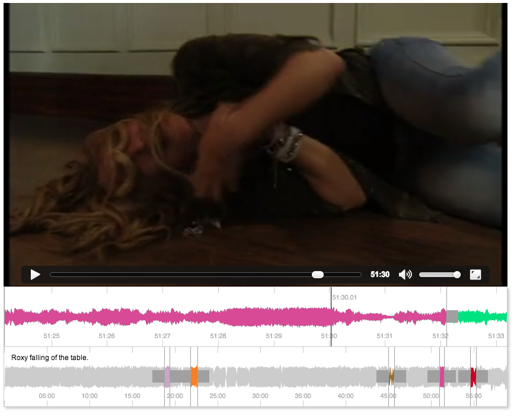

```
     ____    ____    ______  __  __   ____         _____  ____
    /\  _`\ /\  _`\ /\  _  \/\ \/\ \ /\  _`\      /\___ \/\  _`\
    \ \ \L\ \ \ \L\_\ \ \L\ \ \ \/'/'\ \,\L\_\    \/__/\ \ \,\L\_\
     \ \ ,__/\ \  _\L\ \  __ \ \ , <  \/_\__ \       _\ \ \/_\__ \
      \ \ \/  \ \ \L\ \ \ \/\ \ \ \\`\  /\ \L\ \  __/\ \_\ \/\ \L\ \
       \ \_\   \ \____/\ \_\ \_\ \_\ \_\\ `\____\/\_\ \____/\ `\____\
        \/_/    \/___/  \/_/\/_/\/_/\/_/ \/_____/\/_/\/___/  \/_____/
```

# PEAKS.JS [](https://travis-ci.org/bbcrd/peaks.js)

> A browser based audio waveform visualisation frontend component from BBC R&D

Peaks is a modular frontend component designed for the display of and interaction with audio waveform material in the browser.



Peaks was developed by [BBC R&D](http://www.bbc.co.uk/rd) to allow users to make accurate clippings of audio data over a timeline in browser, using a backend API that serves the waveform data.

Peaks utilizes HTML5 canvas technology to display waveform data at different zoom levels and provides some basic convenience methods for interacting with waveforms and creating time-based visual sections for denoting content to be clipped or for reference, eg: distinguishing music from speech or identifying different music tracks.

See the Project overview here: [http://waveform.prototyping.bbc.co.uk/](http://waveform.prototyping.bbc.co.uk/)

# Installation

<table>
  <thead>
    <tr>
      <th><a href="https://npmjs.org/">npm</a></th>
      <th><a href="https://github.com/bower/bower">bower</a></th>
      <th>old school</th>
    </tr>
  </thead>
  <tbody>
    <tr>
      <td><code>npm install --save peaks.js</code></td>
      <td><code>bower install --save peaks.js</code></td>
      <td><a href="https://github.com/bbcrd/peaks.js/archive/master.zip">download zip file</a></td>
    </tr>
  </tbody>
</table>

# Using Peaks.js in your own project

Peaks can be included in any web page by following these steps:

1. include it your web page
1. include a media element and its [waveform data file](https://github.com/bbcrd/audiowaveform)
1. initialise Peaks

```html
<div id="peaks-container"></div>
<audio>
  <source src="test_data/sample.mp3" type="audio/mpeg">
  <source src="test_data/sample.ogg" type="audio/ogg">
</audio>
<script src="bower_components/requirejs/require.js" data-main="app.js"></script>
```

## Start using [require.js](http://requirejs.org/)

AMD modules are working out of the box without any optimiser.

```javascript
// in app.js
// configure peaks path
requirejs.config({
  paths: {
    peaks: 'bower_components/peaks.js/src/main',
    EventEmitter: 'bower_components/eventEmitter/EventEmitter',
    'waveform-data': 'bower_components/waveform-data/dist/waveform-data.min'
  }
});

// requires it
require(['peaks'], function (Peaks) {
  var p = Peaks.init({
    container: document.querySelector('#peaks-container'),
    mediaElement: document.querySelector('audio'),
    dataUri: 'test_data/sample.dat'
  });

  p.on('segments.ready', function(){
    // do something when segments are ready to be displayed
  });
});
```

Working examples are provided in [`demo_page.html`](demo_page.html) and [`demo_page_dev.html`](demo_page_dev.html).

## Start using vanilla JavaScript

```html
<script src="path/to/build/js/peaks.min.js"></script>
<script>
var p = peaks.init({
});
</script>
```

**Notice**: as of `peaks@0.2.0`, the vanilla JavaScript build is not shipped anymore.
Please [see below](#building-peaks) to learn more about how to build Peaks for development or production purpose.

## Web Audio based waveforms

Since `0.3.0`, Peaks can rely on Web Audio to generate waveforms.
Which means you would not have to pre-generate a `dat` or `json` beforehand.

To do so, skip the `dataUri` option and make sure [your browser is compatible with Web Audio](http://caniuse.com/#feat=audio-api).

```js
var p = Peaks.init({
  container: document.querySelector('#peaks-container'),
  mediaElement: document.querySelector('audio')
});

p.on('segments.ready', function(){
  // do something when segments are ready to be displayed
});
```

**Notice**: be aware **it can be CPU intensive** if your audio file has a long duration.

# Configuration

The available options for configuration of the viewer are as follows:

```javascript
var options = {
  /** REQUIRED OPTIONS **/
  // Containing element
  container: document.getElementById('peaks-container'),
  // HTML5 Media element containing an audio track
  mediaElement: document.getElementById('media'),
  // URI to waveform data file in binary or JSON
  dataUri: '../test_data/sample.dat',

  /** Optional config with defaults **/
  // height of the waveform canvases in pixels
  height: 200,
  // Array of zoom levels in samples per pixel (big >> small)
  zoomLevels: [512, 1024, 2048, 4096],
  // Bind keyboard controls
  keyboard: false,
  // Keyboard nudge increment in seconds (left arrow/right arrow)
  nudgeIncrement: 0.01,
  // Colour for the in marker of segments
  inMarkerColor: '#a0a0a0',
  // Colour for the out marker of segments
  outMarkerColor: '#a0a0a0',
  // Colour for the zoomed in waveform
  zoomWaveformColor: 'rgba(0, 225, 128, 1)',
  // Colour for the overview waveform
  overviewWaveformColor: 'rgba(0,0,0,0.2)',
  // Colour for segments on the waveform
  segmentColor: 'rgba(255, 161, 39, 1)',
  // Colour of the play head
  playheadColor: 'rgba(0, 0, 0, 1)',
  // Random colour per segment (overrides segmentColor)
  randomizeSegmentColor: true,

  // Array of initial segment objects with startTime and
  // endTime in seconds and a boolean for editable.
  // See below.
  segments: [{
    startTime: 120,
    endTime: 140,
    editable: true,
    color: "#ff0000",
    labelText: "My label"
  },
  {
    startTime: 220,
    endTime: 240,
    editable: false,
    color: "#00ff00",
    labelText: "My Second label"
  }]
}
```

## Segment Format

Segments provided from peaks.js use the following format:

```javascript
[{
   // Assigned colour of the segment
  color: "rgba(123, 2, 61, 1)",
   // Editable state of the segment
  editable: true,
   // End time in seconds of the segment
  endTime: 588.986667,
   // Unique ID of the segment
  id: "segment0",
   // Kinetics.js Element group of segment canvas objects for overview waveform
  overview: Kinetic.Group,
   // End time in seconds of the segment
  startTime: 578.986667,
   // Kinetics.js Element group of segment canvas objects for overview waveform
  zoom: Kinetic.Group
}]
```

## Advanced configuration

The marker and label Kinetic.js objects may be overridden to give the segment markers or label your own custom appearance (see main.js / waveform.mixins.js, [Kinetic Polygon Example](http://www.html5canvastutorials.com/kineticjs/html5-canvas-kineticjs-polygon-tutorial/) and [Kinetic Text Example](http://www.html5canvastutorials.com/kineticjs/html5-canvas-kineticjs-text-tutorial/)) :

```javascript
{
  segmentInMarker: mixins.defaultInMarker(p.options),
  segmentOutMarker: mixins.defaultOutMarker(p.options),
  segmentLabelDraw: mixins.defaultSegmentLabelDraw(p.options)
}
```

# API

The top level `peaks` object exposes a factory to create new `peaks` instances.

## `peaks.init(options)`

Start a instance of peaks with the [assigned options](#Configuration). It enables you do deal with several instances
of Peaks within a single page with one or several configurations.

```js
var peaksInstance = peaks.init({ … });
var secondPeaksInstance = peaks.init({ … });
```

## Time API

### `instance.time.getCurrentTime()`

Returns currently selected time in seconds (convenience method interchangeable with `mediaElement.currentTime`).

```js
var instance = peaks.init({ … });

console.log(instance.time.getCurrentTime()); // -> 0
```

### `instance.time.setCurrentTime(timeInSeconds)`

Sets the media element selected time in seconds.

```js
var instance = peaks.init({ … });

instance.time.setCurrentTime(5.85);
console.log(instance.time.getCurrentTime()); // -> 5.85
```

## Zoom API

### `instance.zoom.zoomOut()`

Zoom in the waveform zoom view by one level.

```js
var instance = peaks.init({ …, zoomLevels: [512, 1024, 2048, 4096] });

instance.zoom.zoomOut(); // zoom level is now 1024
```

### `instance.zoom.zoomIn()`

Zoom in the waveform zoom view by one level.

```js
var instance = peaks.init({ …, zoomLevels: [512, 1024, 2048, 4096] });

instance.zoom.zoomIn(); // zoom level is still 512

instance.zoom.zoomOut(); // zoom level is now 1024
instance.zoom.zoomIn(); // zoom level is now 512 again
```

### `instance.zoom.setZoom(indexInZoomArray)`

Set the zoom level to the element in the `options.zoomLevels` array at index `indexInZoomArray`.

```js
var instance = peaks.init({ …, zoomLevels: [512, 1024, 2048, 4096] });

instance.zoom.setZoom(3); // zoom level is now 4096
```

### `instance.zoom.getZoom()`

Return the current zoom level.

```js
var instance = peaks.init({ …, zoomLevels: [512, 1024, 2048, 4096] });

instance.zoom.zoomOut();
console.log(instance.zoom.getZoom()); // -> 1
```

## Segments API

**Segments** give the ability to visually tag timed portions of a media object.
This is a great way to provide visual cues to your users.

### `instance.segments.add(startTime, endTime, editable, color, labelText)`
### `instance.segments.add(segment[])`

Add a segment to the waveform timeline with starting time `startTime` (seconds), ending time `endTime` (seconds)
and set whether the segment is user editable with `editable` (boolean, defaults to `false`).

```js
var instance = peaks.init({ … });

instance.segments.add(0, 10.5); //adds a 0 to 10.5 seconds non-editable segment with a random color
```

Alternatively, provide an array of segment objects as shown above in the config options as the first and only argument to add all those segments at once.

```js
var instance = peaks.init({ … });

instance.segments.add([
  {
    startTime: 0,
    endTime: 10.5,
    labelText: '0 to 10 seconds non-editable demo segment'
  },
  {
    startTime: 3.14,
    endTime: 4.2,
    color: '#666'
  }
]);
```

## #`instance.segments.getSegments()`

Returns an array of objects representing all displayed segments present on the timeline in the segment format.

### `instance.segments.removeByTime(timeStart, timeEnd)`

Remove any segment which start at `timeStart`, and which optionally finish at `timeEnd`.

The returned value corresponds to the number of deleted segments.

```js
var instance = peaks.init({ … });

instance.segments.add([{ startTime: 10, endTime: 12 }, { startTime: 10, endTime: 20 }]);

// remove both segments as they start at `10`
instance.segments.removeByTime(10);

// remove only the first segment
instance.segments.removeByTime(10, 12);

```

### `instance.segments.removeAll()`

Remove all the segments from the waveforms.

```js
var instance = peaks.init({ … });

instance.segments.removeAll();
```

# Building Peaks

You might want to build a minified standalone version of Peaks, to test a contribution or to run additional tests.
The project *bundles* everything you need to do so.

## Prerequisite

```bash
git clone https://github.com/bbcrd/peaks.js.git
cd peaks.js
npm install -g grunt-cli bower
npm install
bower install
```

## Building

This command will produce a minified standalone version of Peaks.
It will indeed be UMD compatible, so as you can continue to use it with AMD or CommonJS module loaders, or even as Vanilla JavaScript.

```bash
grunt build
```

The output of the build will be located in the `build/js` folder, alongside its associated [Source Maps](https://hacks.mozilla.org/2013/05/compiling-to-javascript-and-debugging-with-source-maps/).

## Development Instance

This command will open a livereload demo page of Peaks to reflect every source code change.

```bash
grunt server-dev
```

## Demo Instance

This command will build Peaks and open a demo using the minified standalone version.

```bash
grunt server-demo
```

# Testing

`npm run test-local` should work for simple one time testing.

If you are developing and want to repeatedly run tests in a browser on your machine simply launch `npm run test-watch`.


# License

See [COPYING](COPYING)

This project includes sample audio from the [radio show Desert Island](http://en.wikipedia.org/wiki/File:Alice_walker_bbc_radio4_desert_island_discs_19_05_2013.flac), used under the terms of the [Creative Commons 3.0 Unported License](http://creativecommons.org/licenses/by/3.0/).

# Authors

>  British Broadcasting Corporation

- [Chris Finch](http://github.com/chrisfinch)
- [Thomas Parisot](https://github.com/oncletom)
- [Chris Needham](http://github.com/chrisn)


# Copyright

Copyright 2014 British Broadcasting Corporation
